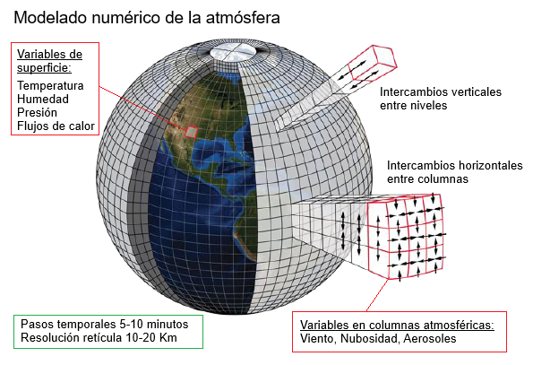

# **Wheater Forcast - Physics Informes Neuronal Network (PINN)** 


Imagen tomada de https://www.comet.ucar.edu © The COMET Program.

Los resultados de este trabajo se utilizaron para la elaboración y defensa del **Trabajo Final de Posgrado** de ***Especialización en Inteligencia Artificial*** dictado por el Laboratorio de Sistemas Embebidos de la Facultad de Ingeniería de la Universidad de Buenos Aires.

## **Tabla de Contenidos**
1. [Resumen](#resumen)  
2. [Características](#características)  
3. [Instalación](#instalación)
4. [Elementos](#ielementos)
7. [Créditos](#créditos)
8. [Autor](#alumno) 
9. [Contacto](#contacto)   

---

## **Resumen**
El presente trabajo se enfoca en el estudio, diseño e implementación de algoritmos y evaluación de un modelo basado en redes neuronales informadas por física (PINN, por su sigla en inglés), para la generación de pronósticos atmosféricos en el sur de Sudamérica. Durante su realización se integraron conocimientos clave, tales como la manipulación de datos meteorológicos, el diseño de arquitecturas de redes neuronales completamente conectadas, la aplicación de conceptos básicos de aprendizaje de física, así como métodos de entrenamiento y técnicas de optimización.

---

## **Características**
- 🧑‍🎓 Académico.  
- 💽 Baja necesidad de espacio.  
- 💻​ Mínimo costo computacional.  
- 🏫 Investigativo.
---

## **Instalación**
Pasos para instalar y configurar el proyecto:  

### Requisitos Previos 
-  
- 🛜 Acceso a internet  

### Pasos
1. Clona el repositorio:  
   ```bash  
   git clone https://github.com/fabriciolopretto/Met_PINN_v1.0.0.git  
   cd Met_PINN_v1.0.0

---

## **Elementos**
1. Archivos con datos de reanálisis ERA5.
2. Artefactos con pesos de modelos entrenados.
3. Bibliografía.
4. Imagenes de de interes presentes en la menoria.
5. Notebook para entrenamiento del modelo sin optmizar.
6. Notebook para entrenamiento del modelo optmizado.
7. Notebooks para optimización del modelo.
8. Notebooks para realizar inferencias con el modelo optimizado. 
9. Plan de proyecto.

---
## **Créditos**
Agradecimientos a las siguientes bibliotecas y recursos:

- Basemap
- Pandas
- netCDF4
- Pytorch

---
## **Links**
- 📝 Memoria del trabajo: https://doi.org/10.13140/RG.2.2.20876.99203
- 🎥 Defensa pública: https://www.youtube.com/watch?v=52y_caAwPQk&t=11458s
- 📽️ Demostración de funcionamiento: https://www.youtube.com/watch?v=kMiOIOJVSmw

---
## **Autor**
Esp. Lic. Fabricio Lopretto </h1>.

---

## **Contacto**
Para dudas o sugerencias, contacto en:
<a href="mailto:fabriciolopretto@gmail.com.ar">
  
</a>
<a href="https://www.linkedin.com/in/fabricio-lopretto-scientific-analyst/"></a>