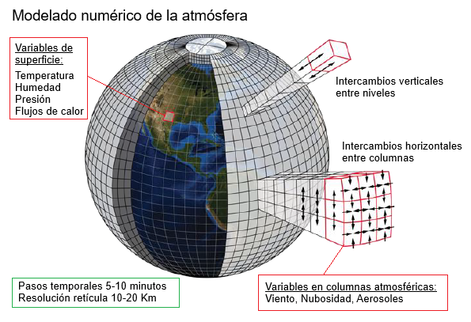

# **Wheater Forcast - Physics Informes Neuronal Network (PINN)** 


Image adapted from https://www.comet.ucar.edu © The COMET Program.

The results of this work were used for the development and public defense of the **Final Thesis** of the **Postgraduate Specialization in Artificial Intelligence**, offered by the *Embedded Systems Laboratory* at the *Faculty of Engineering, University of Buenos Aires*.

## **Table of Contents**

1. [Overview](#overview)
2. [Features](#features)
3. [Installation](#installation)
4. [Project Contents](#project-contents)
5. [Credits](#credits)
6. [Links](#links)
7. [Author](#author)

---
## **Overview**

This project focuses on the study, design, implementation, and evaluation of a **Physics-Informed Neural Network (PINN)** for atmospheric weather forecasting over southern South America.

Throughout this work, several key topics were addressed, including meteorological data processing, the design of fully connected neural network architectures, the application of physics-informed machine learning principles, as well as training methodologies and optimization techniques.

---
## **Features**

- 🧑‍🎓 Academic project.
- 💽 Low storage requirements.
- 💻 Minimal computational cost.
- 🏫 Research-oriented.

---
---

## **Installation**

### Prerequisites

- 
- 🛜 Internet connection

### Steps

1. Clone the repository:

```bash
git clone https://github.com/fabriciolopretto/Met_PINN_v1.0.0.git
cd Met_PINN_v1.0.0
```

---

## **Project Contents**

1. ERA5 reanalysis datasets.
2. Trained model weight artifacts.
3. Bibliographic references.
4. Figures and images used throughout the thesis.
5. Notebook for training the baseline (non-optimized) model.
6. Notebook for training the optimized model.
7. Notebooks for hyperparameter optimization.
8. Notebooks for performing inference with the optimized model.
9. Project plan.

---

## **Credits**

This project makes use of the following libraries and resources:

- Basemap
- Pandas
- netCDF4
- PyTorch

---

## **Links**

- 📝 Thesis manuscript: https://doi.org/10.13140/RG.2.2.20876.99203
- 🎥 Public thesis defense: https://www.youtube.com/watch?v=52y_caAwPQk&t=11458s
- 📽️ Project demonstration: https://www.youtube.com/watch?v=kMiOIOJVSmw

---

## **Author**

**Esp. Lic. Fabricio Lopretto**


## **Contact**
<a href="mailto:fabriciolopretto@gmail.com.ar">
  
</a>
<a href="https://www.linkedin.com/in/fabricio-lopretto-scientific-analyst/"></a>
